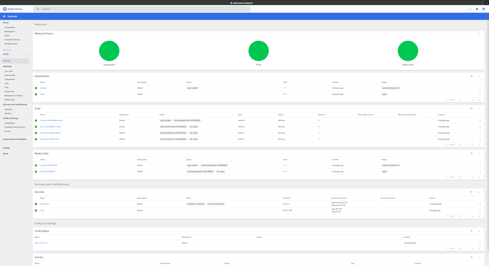

# Zero to Kubernetes

Generate a kubernetes cluster without/before using gcloud/ews or other cloud providers.

For educational purposes only, not ment to be used on production.

Based on (all credits to) [https://github.com/kelseyhightower/kubernetes-the-hard-way](https://github.com/kelseyhightower/kubernetes-the-hard-way)

## Extra

Ooptioanlly, also install and proxy the [Kubernetes Dashboard](https://kubernetes.io/docs/tasks/access-application-cluster/web-ui-dashboard/), and add use a certbot certificate on the load balancer.

A two controllers and two workers deployment output:

## Getting Started

### All in one deploayment with: `vagrant up --provider=libvirt`

Requirements:

- [Vagrant](https://www.vagrantup.com/)
- [vagrant-libvirt](https://github.com/vagrant-libvirt/vagrant-libvirt)

### Sligthly modyfied from the [original](https://github.com/kelseyhightower/kubernetes-the-hard-way) docs

- [01- Client tools](docs/01-client-tools.md)
- [02- Certificates](docs/02-certificates.md)
- [03- Configurations](docs/03-configs.md)
- ...

### Scripts [./scripts](./scripts)

- [./scripts/01-tools.sh](./scripts/01-tools.sh)
- [./scripts/02-certificates.sh](./scripts/02-certificates.sh)
- [./scripts/03-configs.sh](./scripts/03-configs.sh)
- [./scripts/04-etcd.sh](./scripts/04-etcd.sh)
- [./scripts/05-controllers.sh](./scripts/05-controllers.sh)
- [./scripts/06-workers.sh](./scripts/06-workers.sh)
- [./scripts/07-net.sh](./scripts/07-net.sh)
- [./scripts/08-smoke_tests.sh](./scripts/08-smoke_tests.sh) # N/A yet
- [./scripts/09-dashboard.sh](./scripts/09-dashboard.sh)
